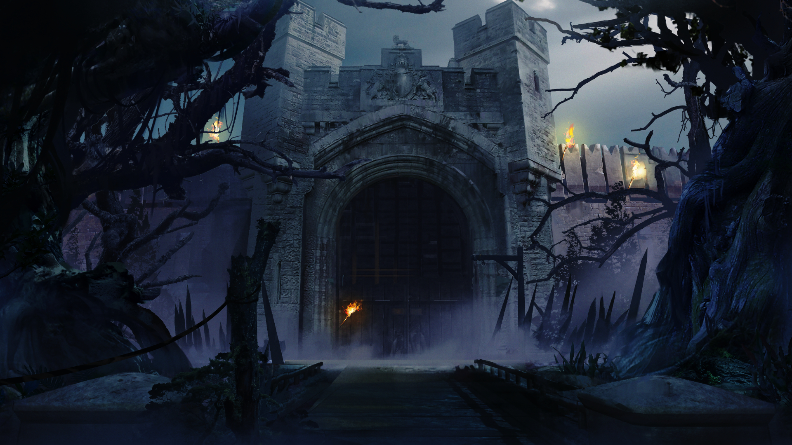

# section_0

## Chapter 1 - Bastone

!>**OPEN MYSTERY ENVELOPE 'A' AND PLACE ITS CONTENTS IN THE CENTER OF PLAY. PLACE THE FREE COMPANY MARKER ON LOCATION 21. PLACE THE CHAPTER 1 TIME TRACK BENEATH THE MAP. TAKE THE "PATH A" CARD.**  

[chp1_21_1__c](../../decomp/app/src/main/res/raw/chp1_21_1__c.mp3 ':include :type=audio')

Location 21 – The Wire Road and the Deepwood Approach

Green mud sucks at your boots, every stride a challenge as you trudge through the rain. Your hands grip the thick iron cable of the Wire Road, pulled taut through rings sunken into the trunks of hideous trees. For days now, it has been the only evidence of humanity's existence in the Deepwood.

Clinging to this lifeline has not worked for everyone though. You are one less than when you left Verum. It was nothing any of you saw. Just a thrum on the wire behind you and then a scream disappearing into the dark. The memory is fresh in your mind, but this is not the time to mourn… not here.

As you travel, vines and black tree trunks spattered with sickly pink cysts block your view ahead. Things slither away and rustle through the undergrowth, but they are of little concern. One cannot afford to jump at every noise in this place or else you'd go mad. It is only when the sounds slither towards you that you need to worry.

Relief from walking through this overgrown hell is promised as the huddled profile of the fortress town of Bastone looms in the distance. They are the ones that sent for you. People have been dying here, though not of hunger or of the Deepwood. Those don't leave much of a man when they're done. Something else is happening here. Something that is leaving plenty of bodies. The crumbling city walls tower before you. As you approach them, you spot something laying at their base.

Choose one:

[1. Explore the base of the wall](output/chapter1/section_57.md)

[2. Get out of the rain and head for Bastone's gates](output/chapter1/section_58.md)

