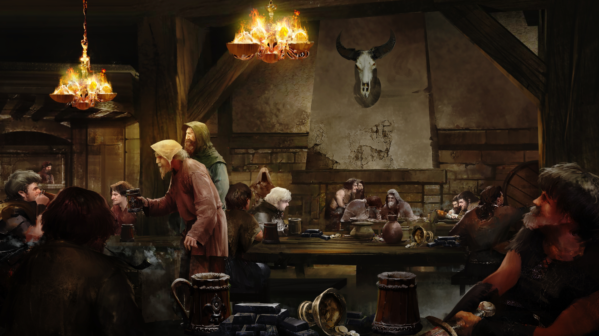

# section_3

>[!TIP|label:Authors|iconVisibility:hidden]
>Written by Jamie Jolly and Paul DeStefano

## Chapter 2 - Eyes in the Dark

[chp2_13_4__a](../../decomp/app/src/main/res/raw/chp2_13_4__a.mp3 ':include :type=audio')

As you finish a shared plate of cheese and roots carefully prepared by Innkeeper Bram, Greycane, the fableman and proprietor of The Broken Oak, works his way across the crowded room and seats himself at your table sporting a jovial look.

"I've seen corpses look better than you lot. Hells, even my ex-wife could summon a better face on a bad day and she was Cistercian."

You wonder at how a man from a town like Bastone would ever have come to marry one of the famously religious, famously celibate people.

Greycane breaks your reverie with a question. Leaning in, his countenance changes, eyes dark and voice low, "Having bad dreams are we?"

[1. Don't reply](output/chapter2/section_4.md)

[2. Describe the experience](output/chapter2/section_5.md)

